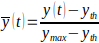
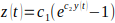
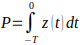
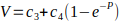

### Attemp to understand PAI calculation from: 

Bjarne M. Nes, Christian R. Gutvik, Carl J. Lavie, Javaid Nauman, Ulrik Wisløff,
Personalized Activity Intelligence (PAI) for Prevention of Cardiovascular Disease and Promotion of Physical Activity,
The American Journal of Medicine,
Volume 130, Issue 3,
2017,
Pages 328-336,
ISSN 0002-9343,
https://doi.org/10.1016/j.amjmed.2016.09.031.

## Algorithm from Supplemental material

Personalized Activity Intelligence (PAI)
The following assumptions found the basis of the model design:

1) Intensity of exercise at individual level is appropriately assessed by using % of heart rate reserve [heart rate relative to resting heart rate and maximum heart rate]. 
2) Very low intensity does not contribute to increased cardiorespiratory fitness, suggesting that a threshold exist before PAI can be accumulated.
3) Increased intensity has been shown to dramatically reduce the amount of exercise needed to increase cardiorespiratory fitness, suggesting a non-linear scaling of intensity for the model2. 
4) Exercise level is fundamentally a product of intensity and time, where assessment from a continuous data stream of heart rate is achieved by integrating the nonlinearly scaled intensity over time.
5) Effect of exercise is most prominent from an inactive baseline, where increased levels show a gradually decaying effect on cardiorespiratory fitness improvement. 
6) When an individual increases cardiorespiratory fitness; resting heart rate, as well as heart rates during submaximal physical activity, become reduced, securing that the absolute levels of physical activity needed to reach 100 PAI becomes higher.

Heart rate is normalized according to assumption 1:

where y(t) [beats per minute] is measured heart rate at time t, ymax is maximum heart rate and yth is the threshold for heart rate according to assumption 2. For computer implementation  is capped,. Normalized intensity  is further scaled with an exponential function containing two unknown coefficients c1 and c2:

where z(t) is referred to as the intensity score (nonlinearly scaled intensity). To assess the exercise level for one week the time-integral (assumption 4) is calculated to give an activity score:

where –T is the time one week since time t [minutes]. Finally, a health-predictive activity score is calculated according to assumption 5 containing two unknown coefficients c3 and c4, representing offset and decay level respectively:

The derivation cohort was used to estimate the coefficients c1 to c4. We used the findings from our previous work3 where a non-exercise model to estimate VO2peak was developed. The same four parameters was used to set up a VO2peak estimator; i.e., physical activity, age, BMI/WC and RHR, where the model presented above, V(t, {yt,  T}, ymax, yth, c1, c2, c3, c4, T) replaced the static index for physical activity used in the previous study3. 

A least-square cost function was then designed, fitting estimated VO2peak with measured VO2peak, and solved using nonlinear programming (quasi-newton method) in Matlab (R2013a). Estimated model coefficients were:

| Coefficient | Men     | Women   |
|-------------|---------|---------|
| c1          | 10.1817 | 9.8556  |
| c2          | 5.7808  | 5.0167  |
| c3          | 41.9374 | 34.2325 |
| c4          | 9.8382  | 9.7581  |

The predictor V is inconvenient for practical implementation and readability. Therefore, PAI was designed as a linear scaling ranging from 0 at complete inactivity to 100 representing recommended activity level. PAI=100, approximated to two sessions per week of 4x4 minutes bouts of high-intensity exercise interspersed with 3 minutes’ active recovery, as previously suggested to be adequate activity level.2, 4-7. PAI will further increase above 100 but not expected provide additional significant health benefit.